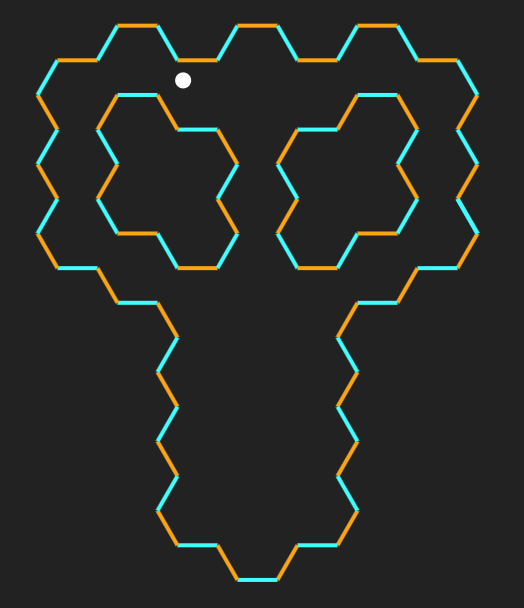

# midi-bounce

Experiments with Web MIDI API - bouncing a ball inside a honeycomb. Click to add/remove tiles.



To install dependencies:

```bash
bun install
```

To run:

```bash
bun dev
```

Expects `loopMIDI` to be available.

This project was created using `bun init` in bun v1.1.32. [Bun](https://bun.sh) is a fast all-in-one JavaScript runtime.

## To Do

Walls of different materials could have properties akin to those used in Web GL to sepcify the properties of interaction with light. Each property would have an effect on the interaction of the wall with the world/the ball/s: low roughness = bouncyness = add to velocity; high roughness = absorbs some of the ball's energy, decreasing velocity.

Currently hard-coded in the main.ts, maybe incorporate the device chooser from MIDI  Feather.
